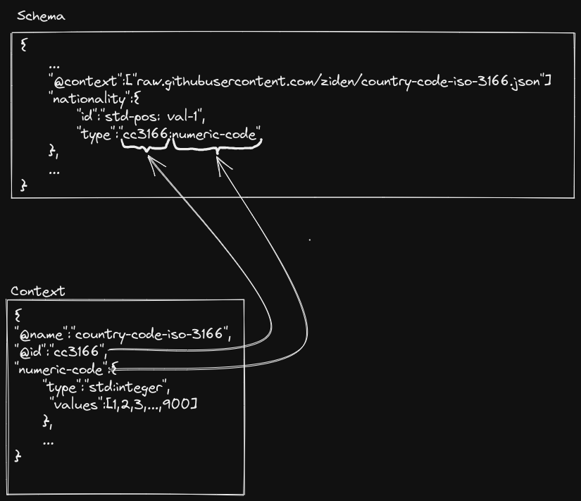

This repository contain some example of the json for Ziden schema with some related context . 
# General information

## @name

- To define the name of the schema or context we use **"@name"** tag.

## @type

- To define whether this is a schema or a context, we use the tag **"@type"** 

## @context

- To define the contexts or the conditions of one or multiple data type in the schema, we use **"@context"** tag.
- This contain an array of URI of predefined contexts that user want to uses in their schema.

## @id
- The **"@id"** tag contain a string that uniquely define the schema or context.    
- For context, the **"@id"** is also used to refer the corresponding context that user want to uses.

Example 



## @hash (schema only)

- **"@hash"** tag contain the hash of the corresponding schema. This help to validate the correctness of the schema we are using.

## @required (schema only)
- **"@required"** tag contain list of the required properties in the the schema

# Property information
## ID
- To specify the position of a property in a claim, we use the tag **"@id"**

**Standard position vocab**

| Notation       | Slot index |
| -------------- |:----------:|
| std-pos:idx-1  |     2      |
| std-pos:idx-2  |     3      |
| std-pos:val-1  |     6      |
| std-pos:val-2  |     7      |

## Data type
- The data type of a property is defined by the **"type"** tag.

### Standard data type

- The standard data type have the id notation of *std* 

| Notation   | Type    | Description                                                |
| ---------- | ------- | ---------------------------------------------------------- |
| std:str    | String  | Standard string data type                                  |
| std:int64  | Integer | Standard 64-bit integer type                               |
| std:double | Double  | Standard 64-bit double type                                |
| std:obj    | Object  | Nesting of one or many child property                      |
| std:bool   | Boolean | Standard boolean data type                                 |
| std:date   | Date    | Date in YYYYMMDD format (no space or delimiter in between) |

### Custom data type

- The custom data type is *the stardard data type* which have *extra conditions or value range*.
- The custom data type can only be defined in context.
- Declaring a new data type is the same as declare a property in a schema.
- To set the acceptable values for a custom property, we use the tag **"values"**. This contain an array of values which the corresponding property can get.
- Some custom data type could have the values abstracted which may confused users so we use the **"@display"** and **"@values"** to distinguish between the values added to claims and the ones displayed for the users. These two list have 1 to 1 mapping, so for each value in the **"@values"** list always has a corresponding value in the **"@display"** list.
Example: 
``` json
{
"@type": "context",
"@name":"US Identity Document",
"@id":"usdi",
"gender":{
	"@type": "std:string",
	"@values": [0, 1, 2],
	"@display": ["male", "female", "other"]
	}
}
```
